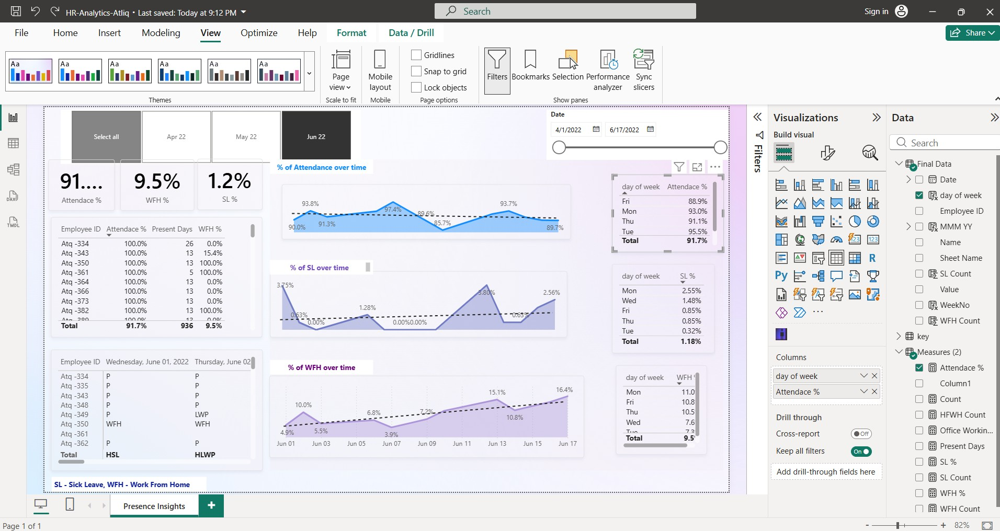

# 📊 HR Workforce Presence Analytics (Power BI)

---

## 🚀 Project Overview

This project transforms raw HR attendance data into a **decision-support system** that enables organizations to optimize workforce management, improve employee well-being, and reduce operational costs.

The interactive Power BI dashboard provides insights into:

- Employee presence trends  
- Work-from-home (WFH) behavior  
- Sick leave patterns  
- Office space utilization  

---

## 🎯 Business Problem

The HR department at **AtliQ Technologies** relied on manual Excel-based tracking, which led to:

- ❌ Limited visibility into workforce trends  
- ❌ Inability to detect early signs of burnout  
- ❌ Inefficient office resource planning  
- ❌ Time-consuming and reactive reporting  

---

## 💡 Solution

Developed an **end-to-end Business Intelligence solution** that:

- Cleans and transforms raw attendance data  
- Models data using a scalable star schema  
- Applies advanced DAX logic for accurate KPIs  
- Delivers an interactive dashboard for real-time decision-making  

---

## 🛠️ Tech Stack

| Layer              | Tools Used |
|------------------|-----------|
| Data Cleaning     | Power Query (M), Python (Pandas - optional) |
| Data Modeling     | Star Schema |
| Analysis          | DAX (Data Analysis Expressions) |
| Visualization     | Power BI |
| Concepts          | ETL, KPI Design, Time-Series Analysis |

---

## 🔄 Data Engineering (ETL)

### 🔴 Challenge
The raw dataset was stored in a **wide format** (dates as columns), making time-series analysis difficult.

### 🟢 Solution
Performed **Unpivot Transformation** in Power Query:
EmpID | 1-Jun | 2-Jun | 3-Jun
**After:**
EmpID | Date   | Attendance Code

### ✅ Outcome
- Enabled time-based analysis  
- Improved scalability and flexibility  
- Created an analytics-ready dataset  

---

## 🧮 Analytical Logic (DAX)

To ensure accurate and business-relevant insights, advanced DAX measures were implemented:

### ✔ Weighted Attendance
- Half-day records (`HWFH`, `HSL`) counted as **0.5**

### ✔ Dynamic Working Days
- Excludes weekends (WO) and holidays (HO)  
- Ensures realistic KPI calculations  

### ✔ Core KPIs
- **Presence %**
- **WFH %**
- **Sick Leave %**
- **Total Working Days**

---

## 📊 Dashboard Features

- Executive KPI cards for quick insights  
- Time-series trend analysis  
- Day-of-week behavioral patterns  
- Employee-level drill-down  
- Interactive filters (Date, Month, Department)  

---

## 🔍 Key Business Insights

### 📅 Friday Effect
- WFH increases by **~15% on Fridays**

👉 **Recommendation:**  
Reduce office operations and schedule maintenance to lower costs.

---

### ⚠️ Burnout Risk Detection
- Increasing Sick Leave combined with declining Presence trends

👉 **Recommendation:**  
Enable early HR intervention and wellness initiatives.

---

### 🏢 Space Optimization
- Average office presence: **~82%**

👉 **Impact:**  
- Supports **Hot-Desking model**  
- Potential **15–20% reduction in office costs**

---

## 📈 Impact Summary

- Reduced manual reporting effort by ~80%  
- Enabled proactive HR decision-making  
- Identified cost-saving opportunities in operations  

## 🚀 Future Enhancements

- 🔐 Row-Level Security (RLS) for data access control  
- 🔄 Automated data refresh via SharePoint  
- 📩 Alert system for anomaly detection  
- 📈 Forecasting and predictive analytics  

---

---

## 🎥 Demo
👉 Click below to watch/download the demo video:

[▶ Download & Watch Demo](./hr_analytics.mp4)

## 🧠 Key Learnings

- Importance of proper data modeling (Star Schema)  
- Handling real-world messy data through ETL processes  
- Translating business problems into measurable KPIs  
- Building dashboards that drive decision-making  

---

## 👨‍💻 Author

**Murad Amin**  
Data Analyst | AI Practitioner  

- Python | SQL | Power BI | Data Modeling  
- Focus: Business-driven analytics & AI systems  

🔗 LinkedIn: www.linkedin.com/in/muradamin
🌐 Portfolio: https://murad-portfolio.lovable.app/

---
